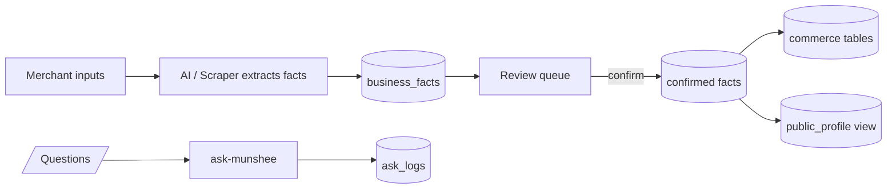

# Munshee.pk

Pakistan's first Business Brain OS � an AI-driven operating system for online sellers that extracts, verifies, and publishes business facts.

## Overview

Munshee.pk ingests merchant inputs (spreadsheets, product images, competitor pages) and uses AI + scraping to extract structured **business facts**. Those facts land in a human **review queue**, where a confirm/reject step guarantees accuracy. Once confirmed, facts flow into operational **commerce tables** (products, variants, inventory, orders, customers) and into a **public profile page** that represents the business on the open web.

## Current Status

- **Real, code-complete:**
  - React 19 shell with React Router 7
  - Supabase auth (PKCE flow)
  - Commerce schema + tables (`products`, `variants`, `orders`, `customers`, `inventory`)
  - CSV import -> fact extraction -> review queue
  - OpenRouter-backed Edge Functions: `extract-text` (text), `extract-vision` (vision), `ask-munshee` (Q&A)
  - Playwright scraper service (`scraper/`)
  - Public, no-auth `/profile/:tenantId` profile page
  - "Ask Munshee" chat
- **Real but runtime-untested � pending live credentials:**
  - Every Supabase-dependent feature requires a **live Supabase project** with all migrations applied. Auth, commerce, the review queue, extraction, and the chat will not run until you supply `VITE_SUPABASE_URL`, `VITE_SUPABASE_ANON_KEY`, the `OPENROUTER_API_KEY` secret, and deploy the Edge Functions.
- **Not yet built:**
  - Nothing. All originally planned features are implemented. There are no stubbed or missing phase items remaining.

## Architecture

Munshee is built on a single **Business Brain** data model.

1. `business_facts` � the single source of truth. Each row is one claim about the business: `category`, `label`, `value`, `confidence`, `source_type`, `source_ref`, `status` (`needs_review` -> `confirmed` -> `rejected`).
2. `audit_log` � append-only trail of every confirm/edit/delete/import action on a fact, with `old_value`/`new_value` JSONB.
3. `ask_logs` � append-only record of every question asked of Munshee, used as conversational training data.
4. Commerce tables (`products`, `variants`, `customers`, `orders`, `inventory`, ...) � **operational consumers** of confirmed facts; facts are the upstream, commerce is the downstream.
5. `public_profile` � a **read-only view** that exposes only `confirmed` facts to unauthenticated visitors on `/profile/:tenantId`.



## Setup

1. Create a Supabase project at https://supabase.com.
2. Copy `.env.example` to `.env.local` and fill in:
   - `VITE_SUPABASE_URL`
   - `VITE_SUPABASE_ANON_KEY`
   - `VITE_SUPABASE_REDIRECT_URL` (default `http://localhost:5173/auth/callback` for local dev)
3. Open the Supabase SQL Editor for your project and run **all** migrations, in order:
   - `supabase/migrations/0001_init.sql`
   - `supabase/migrations/0002_commerce.sql`
   - `supabase/migrations/0003_commerce_extras.sql`
   - `supabase/migrations/0004_provenance.sql`
   - `supabase/migrations/0005_business_facts.sql`
4. Set the OpenRouter secret in the Supabase Dashboard -> **Edge Functions -> Secrets**:
   - `OPENROUTER_API_KEY`
5. Deploy the Edge Functions:
   ```bash
   npx supabase login
   npx supabase link --project-ref <your-project-ref>
   npx supabase functions deploy extract-text
   npx supabase functions deploy extract-vision
   npx supabase functions deploy ask-munshee
   ```
6. (Optional) Run the Playwright scraper service locally � see `scraper/README.md`.
7. Install dependencies and start the dev server:
   ```bash
   pnpm install
   pnpm dev
   ```
8. Open http://localhost:5173.

## Stack

- Frontend: React 19, TypeScript 5.x (strict), Vite 6, React Router 7, Tailwind 3.4, TanStack Query v5
- Backend: Supabase (Postgres, Auth PKCE, Edge Functions on Deno)
- LLMs via OpenRouter (server-side only):
  - `meta-llama/llama-3.3-70b` � text extraction + Q&A
  - `qwen/qwen-2.5-vl-72b` � vision extraction
- Scraper: Playwright (Node.js + Express microservice, deploy separately on Render/Railway)
- Hosting: React frontend on Cloudflare Pages (`@cloudflare/vite-plugin`); functions + DB on Supabase

## Scripts

| Command | What it does |
| --- | --- |
| `pnpm dev` | Local dev server (Vite) |
| `pnpm build` | `tsc -b` typecheck + production Vite build |
| `pnpm cf:build` | Production build for Cloudflare Pages |
| `pnpm preview` | Preview the production build locally |
| `pnpm typecheck` | Type-check only (`tsc --noEmit`) |

## Key Routes

| Route | Purpose |
| --- | --- |
| `/login`, `/signup`, `/auth/callback` | Auth (PKCE) |
| `/` | Redirect to `/dashboard` or `/login` |
| `/dashboard` | Authenticated dashboard |
| `/apps/products[/new][/:id]` | Products + variants |
| `/apps/orders[/new][/:id]` | Orders |
| `/apps/customers[/new][/:id]` | Customers |
| `/apps/import` | CSV import |
| `/apps/review[/:id]` | Fact review queue (approve / reject) |
| `/apps/extract/text` | Extract structured facts from pasted text (OpenRouter) |
| `/apps/extract/vision` | Extract structured facts from an image (OpenRouter vision) |
| `/apps/scrape` | Trigger a Playwright scrape of a URL |
| `/apps/ask` | Ask Munshee chat |
| `/profile/:tenantId` | Public business profile � no auth required |


## Local Development with HTTPS (Cloudflare Tunnel)

For one-on-one merchant demos without deploying to production, you can expose your local dev server with a real HTTPS URL using cloudflared:

### Install cloudflared
- Windows: winget install Cloudflare.cloudflared
- macOS: rew install cloudflared
- Linux: see https://github.com/cloudflare/cloudflared/releases

### Run a quick tunnel (no account needed)
\\\ash
# Terminal 1: start dev server
pnpm dev

# Terminal 2: start tunnel
cloudflared tunnel --url http://localhost:5173
\\\

Cloudflared will print a \https://<random>.trycloudflare.com\ URL. Share this URL with your test merchant � they get a real HTTPS link to your local instance.

**Note:** Quick tunnels are temporary. For persistent URLs, create a named tunnel (requires a Cloudflare account).

## Local Development

Spin up the full local stack with two terminals:

```bash
# Terminal 1 — local Supabase stack (Postgres, Auth, Studio)
pnpm dev:supabase

# Terminal 2 — Vite dev server
pnpm dev
```

| Command | What it does |
| --- | --- |
| `pnpm dev` | Starts the Vite dev server at `http://localhost:5173` |
| `pnpm dev:supabase` | Starts the local Supabase stack (Docker) at `http://localhost:54321` |
| `pnpm dev:functions` | Serves Edge Functions locally (`supabase functions serve`) |
| `pnpm dev:supabase:stop` | Stops the local Supabase stack |
| `pnpm typecheck` | Type checking only (`tsc --noEmit`) |
| `pnpm build` | Production build (`tsc -b && vite build`) |
| `pnpm test:e2e` | Runs the Playwright E2E tests |

- The `.env.local` file is pre-configured for local dev and already exists — it points `VITE_SUPABASE_URL` at the local stack and ships with the demo anon key that `supabase start` creates.
- Supabase Studio is available at `http://localhost:54323` once the stack is running.
- `pnpm test:e2e` boots the Vite dev server automatically via the Playwright `webServer` config, so keep the Supabase stack running in Terminal 1.

## Flagged Costs

- **Supabase** (free tier): 500 MB database, 50k monthly active users. Auth + commerce + functions usage fits this tier for development and small pilots.
- **Cloudflare Pages**: free.
- **OpenRouter**: the free tier is heavily rate-limited for the heavy models used here (~50 requests/day on `:free` models). To raise the daily free-model limit from 50 to 1,000 requests/day, purchase **$10 in credits** (one-time, credits never expire). Note: the 20 requests/minute cap applies regardless of balance and cannot be raised by paying more. Treat the free tier as smoke-test-only; for any real usage, the $10 credit purchase is recommended.


## Free-Tier Integrations

The following services are **optional** and the app runs fine with them unset. Set them when you're ready:

| Service | Purpose | Free Tier | Setup URL |
|---------|---------|-----------|-----------|
| Resend | Auth emails (password reset, email verification) | 3,000 emails/month, 100/day, 3 domains | [resend.com/keys](https://resend.com/keys) |
| PostHog | Product analytics | 1M events/month, 1 project | [posthog.com/signup](https://posthog.com/signup) |
| GlitchTip or Sentry | Error tracking | 1,000 events/mo (GlitchTip) or 5,000 errors/mo (Sentry) | [glitchtip.com](https://app.glitchtip.com) or [sentry.io](https://sentry.io) |
| UptimeRobot | Uptime monitoring | 50 monitors, 5-min intervals | [uptimerobot.com](https://uptimerobot.com) |
| OpenRouter | LLM inference (extraction, Ask Munshee) | $10 one-time, 1000 req/day | [openrouter.ai](https://openrouter.ai) |

All free tiers verified directly on the provider's pricing page � no credit card required for the free tier on any of these (Resend's Free plan is limited to 100 emails/day).

**Note:** free-for-dev (ripienaar/free-for-dev) was used as a *discovery* list; all limits above were verified against the current provider pricing pages, not just the list text.

**UptimeRobot setup:** Once deployed to Cloudflare Pages, create a free UptimeRobot account, add a monitor for your munshee.pk URL (HTTP(s) monitor type), and set the alert contact to your email. The 50-monitor free tier covers the main site plus any subdomains you expose.

## Notes

- No Gemini anywhere in the codebase � all LLM calls go through OpenRouter.
- All LLM calls are server-side via Supabase Edge Functions; no model keys ever reach the browser.
- Row-level security is enabled on every table, scoped to `tenant_id = auth.uid()`.
- Money is stored as `numeric(12,2)` in Postgres and rendered through the `<Money>` component (`src/components/Money.tsx`).

## Contributing

Pull requests are welcome. Run `pnpm typecheck` before opening one; `pnpm build` must pass.


